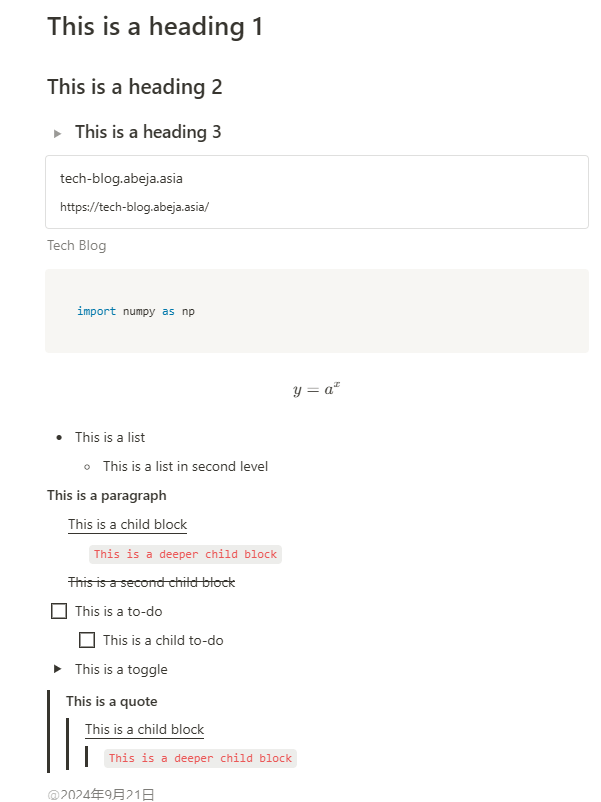

# Notion-extension

This tools is a wrapper library of the [notion-sdk-py](https://github.com/ramnes/notion-sdk-py). Notion-extension provides high-level API to handle Notion API in an easy way. Be aware of [request-limit](https://developers.notion.com/reference/request-limits) of the Notion API.

## Prerequisites

1. Prepare Notion integration and get API key. In ABEJA, Notion integration is managed by itsupport, so please ask them to create integration when you wants.
    - See: [getting-started](https://developers.notion.com/docs/create-a-notion-integration#getting-started)
2. Connect your notion integration to the database you want to retrieve. Note that adding integration to the database needs proper permission.
    - See: [give-your-integration-page-permissions](https://developers.notion.com/docs/create-a-notion-integration#give-your-integration-page-permissions)
3. Get database id from the URL in the database page.
    - See: [retrieve-a-database](https://developers.notion.com/reference/retrieve-a-database)

## Installation

This tool is just a package that can be installed by poetry and pip.

```shell
poetry add --editable /path/to/notion_extension
```

## Basic usage

### Instantiate client

```python
from notion_extension import Client

client = Client(auth="<your NOTION_API_KEY>")
```

Async clinet is availabe as well.

```python
from notion_extension import AsyncClient

client = AsyncClient(auth="<your NOTION_API_KEY>")
```

### Fetch user information

For synchronous client: 

```python
email = "email-address-of-the-user"
user = client.get_user_info(email=email)
```

For asynchronous client:
```python
user = await client.get_user_info(email=email)
```

### Fetch entire database

For synchronous client:

```python
target_pages = client.get_entire_database(
    database_id="<your DATABASE_ID>",
)
```

You can filter by sending filter object to the API. 

```python
target_pages = client.get_entire_database(
    database_id="<your DATABASE_ID>",
    filter={"property": "Created time", "date": {"on_or_after": "2024-09-01"}},
)
```

For asynchronous client:
```python
target_pages = await client.get_entire_database(
    database_id="<your DATABASE_ID>,
)
```

For more details, see [https://developers.notion.com/reference/post-database-query-filter](https://developers.notion.com/reference/post-database-query-filter)


### Create an empty page in the database with properties

Once you prepared Notion DB, you can add contents into that DB by high-level API. Here is an example of contents creation:

```python
from notion_extension import Properties, Property

properties = Properties(
    properties=[
        Property.title(name="title", text="Hello World"),
        Property.checkbox(name="checkbox", checkbox=True),
        Property.description(name="text", text="This is a description"),
        Property.status(name="status", status="Done"),
        Property.select(name="select", value="LLM"),
        Property.multi_select(name="multi-select", values=["CV", "Tabular"]),
        Property.url(name="url", url="https://www.abejainc.com/"),
        Property.date(name="date", start="2024-09-21"),
        Property.people(name="user", people=[user]),
    ]
)

page = client.create_page(
    database_id="<your DATABASE_ID>",
    properties=properties,
)
```

For async client: 

```python
page = await client.create_page(
    database_id="<your DATABASE_ID>",
    properties=properties,
)
```

Supported properties: 

- `title`
- `description (text)`
- `status`
- `select`
- `multi-select`
- `checkbox`
- `url`
- `date`
- `people (user)`

### Create a page in the database with properties and contents

High-level API allows you to create the contents within a page as you stack blocks when the page is created. Nested block is also supported. Here is an example: 

```python
from notion_extension import Block, Blocks

page_contents = Blocks(
    blocks=[
        Block.heading_1(content="This is a heading 1"),
        Block.heading_2(content="This is a heading 2"),
        Block.heading_3(content="This is a heading 3", is_toggleable=True),
        Block.bookmark(url="https://tech-blog.abeja.asia/", caption="Tech Blog"),
        Block.code(content="import numpy as np", language="python"),
        Block.equation(expression="y=a^{x}"),
        Block.bulleted_list_item(
            content="This is a list",
            children=Blocks(blocks=[Block.bulleted_list_item(content="This is a list in second level")]),
        ),
        Block.paragraph(
            content="This is a paragraph",
            bold=True,
            children=Blocks(
                blocks=[
                    Block.paragraph(
                        content="This is a child block",
                        underline=True,
                        children=Blocks(
                            blocks=[Block.paragraph(content="This is a deeper child block", code=True)]
                        ),
                    ),
                    Block.paragraph(
                        content="This is a second child block",
                        strikethrough=True,
                    ),
                ]
            ),
        ),
        Block.todo(
            content="This is a to-do", children=Blocks(blocks=[Block.todo(content="This is a child to-do")])
        ),
        Block.toggle(
            content="This is a toggle", children=Blocks(blocks=[Block.toggle(content="This is a child toggle")])
        ),
        Block.quote(
            content="This is a quote",
            bold=True,
            children=Blocks(
                blocks=[
                    Block.quote(
                        content="This is a child block",
                        underline=True,
                        children=Blocks(
                            blocks=[Block.quote(content="This is a deeper child block", code=True)]
                        ),
                    )
                ]
            ),
        ),
        Block.date_mention(date="2024-09-21"),
        Block.user_mention(user_id=user["id"]),
    ]
)

page = client.create_page(
    database_id="<your DATABASE_ID>",
    properties=properties,
    page_contents=page_contents,
)
```

This code creates a page as follows: 



Supported blocks: 

- `heading_1`
- `heading_2`
- `heading_3`
- `paragraph`
    - `link overlayed text`
    - `plain text`
    - `styled text`
    - `inline code`
- `bulleted_list_item`
- `numbered_list_item`
- `mention`
    - `page_mention`
    - `user_mention`
    - `date_mention`
- `code`
- `equation`
- `bookmark`
- `breadcrumb`
- `divider`
- `quote`
- `todo`
- `toggle`

### Append blocks to existing page

Also you can append blocks to existing page by `append_blocks_to_page` method. Here is an example: 

```python
from notion_extension import Blocks, Block

client.append_blocks_to_page(
    page_id=page_id,
    blocks=Blocks(
        blocks=[
            Block.heading_1("This is a appended heading 1"),
            Block.paragraph(
                "This is a appended paragraph",
                bold=True,
                children=Blocks(
                    blocks=[
                        Block.paragraph(
                            "This is a child block",
                            underline=True,
                            children=Blocks(
                                blocks=[Block.paragraph("This is a deeper child block", code=True)]
                            ),
                        ),
                        Block.paragraph(
                            "This is a second child block",
                            strikethrough=True,
                        ),
                    ]
                ),
            ),
        ]
    ),
)

```


### Converting markdown text to blocks instance

Some markdown syntax can be converted to the blocks instance that is interface of high-level API. 

```python
from notion_extension import Blocks

blocks: Blocks = Blocks.from_markdown(markdown)
```

Here is supported markdown syntaxes.

- Headings: `#`, `##`, `###`
- Bulleted list: `-`, `*`
- Numbered list: `1.`, `2.`, ...
- Paragraph
- Link: `[text](url)`
- Page mention: `[xxx:page_id]`
- Inline code
- Inline equation
- Code block (only Python)
- Equation block

### Converting response to markdown text

Response of the API is JSON object. `notion-extension` supports conversion from the response to markdown text.

```python
from notion_extension import blocks2markdown

target_pages = client.get_entire_database(database_id="<your DATABASE_ID>")

markdown = ""
for page in target_pages:
    page_id = page["id"]
    blocks = client.get_all_blocks(page_id=page_id)
    markdown_block = blocks2markdown(blocks)
    markdown += markdown_block
```

### Complex rich text

When you add `paragraph/bulleted_list_item/numbered_list_item` with any mention, link or inline code, or you want to emphasize a part of the text by specific text style, you may have to combine different types of rich text. In that case, you can handle `RichText` object directly like this.

```python
from notion_extension import RichTextFactory

rich_texts = [
    RichTextFactory.text(content=text[: inline_code.start()]),
    RichTextFactory.text(content=code.strip("`"), code=True),
    RichTextFactory.text(content=text[inline_code.end() :]),
    RichTextFactory.text(content=link_text, link=link_url),
]

Block.paragraph_from_rich_text(rich_text=rich_texts)
```

This `from_rich_text` interface is supported for `paragraph`, `bulleted_list_item` and `numbered_list_item`.

### Handling Notion API limitation

As mentioned above, Notion API has the [request-limit](https://developers.notion.com/reference/request-limits), for example, 100 blocks per request. `notion_extension` provides `make_batch` function to handle this limitation like this:

```python
from notion_extension import make_batch

# Notion API limits the number of blocks per request to 100.
# See: https://developers.notion.com/reference/request-limits
blocks: list[Block]
for i, batch in enumerate(make_batch(blocks, batch_size=10)):
    if i == 0:
        page = self.notion_client.create_page(
            database_id=database_id,
            properties=db_properties,
            page_contents=Blocks(blocks=batch),
        )
    else:
        self.notion_client.append_blocks_to_page(
            page_id=page["id"],
            blocks=Blocks(blocks=batch),
        )

```

### Lower-level API
This tool is just wrapper of [notion-sdk-py](https://github.com/ramnes/notion-sdk-py), so supports all features of this package. You can also create database using API as you can see in this [script](https://github.com/ramnes/notion-sdk-py/blob/main/examples/databases/create_database.py).


## Future work
- More support on converting markdown to notion blocks